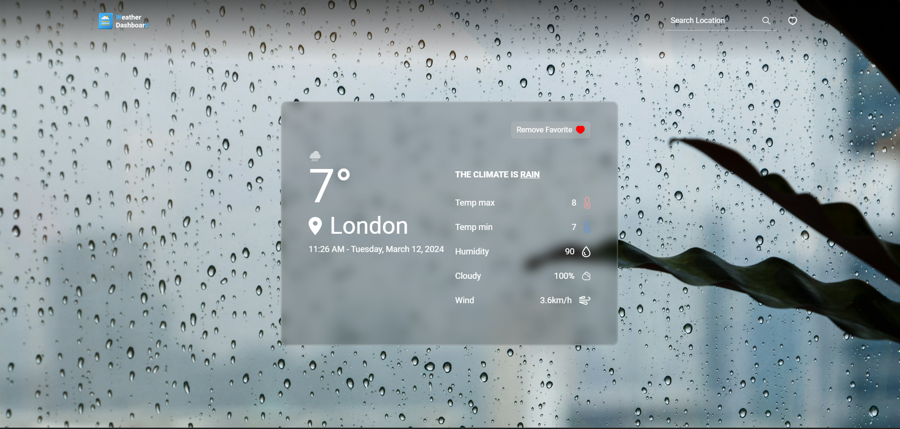

# Weather Dashboard

## Deployment

### [Deployed at Vercel 🔗](https://weather-dashboard-react-one.vercel.app/)

## Preview



## Local Setup

### 1. Clone the repo

```bash
git clone https://github.com/irahuldutta02/weather-dashboard-react
cd weather-dashboard-react
```

### 2. Install dependencies

```bash
npm install
```

### 3. Set up the .env file

```bash
VITE_WEATHER_API_KEY = <your_api_key>
# get it from https://openweathermap.org/api
```

### 4. Start the development server

```bash
npm run dev
```

## Technologies 

### Tech Stack used
- React
- Tailwind CSS


